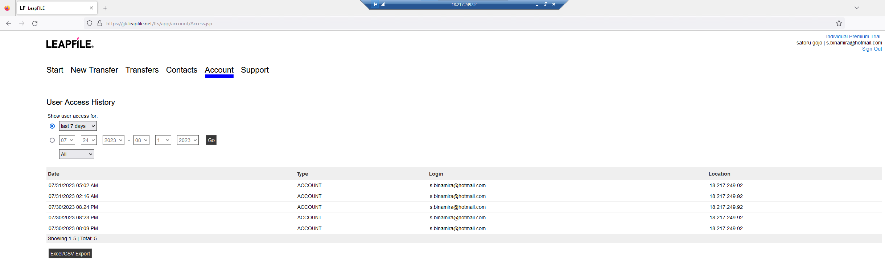
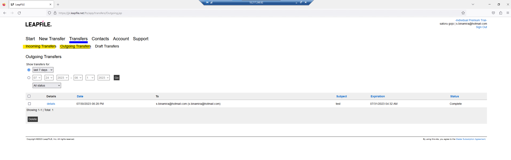
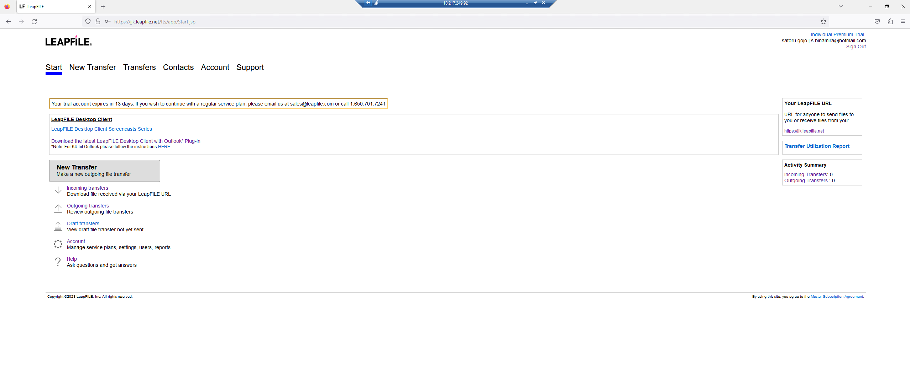

| **Key Software Components**                                             | **NOTES**                                                                                                                                                 |                                                                                                  |
|-------------------------------------------------------------------------|-----------------------------------------------------------------------------------------------------------------------------------------------------------|--------------------------------------------------------------------------------------------------|
| **Web Hosting Process:**                                                | LeapFILEComHub.exe                                                                                                                                        |                                                                                                  |
| **Web Hosting Process Parent:**                                         | services.exe                                                                                                                                              |                                                                                                  |
| **Web Hosting Process Grandparent:**                                    | winnit.exe                                                                                                                                                |                                                                                                  |
| **Web Hosting Process Working Directory:**                              | C:\\Program Files (x86)\\LeapFILE\\LeapFILE Desktop\\LeapFILEComHub.exe                                                                                   |                                                                                                  |
| **Web Hosting Process Command Line:**                                   | "C:\\Program Files (x86)\\LeapFILE\\LeapFILE Desktop\\LeapFILEComHub.exe"                                                                                 |                                                                                                  |
| **Hosting Process for Desktop Client:**                                 | LeapFILEDesktopClient.exe                                                                                                                                 | BROWSER BASED MFT, DESKTOP CLIENT IS OPTIONAL                                                    |
| **Hosting Process Parent for Desktop Client:**                          | explorer.exe                                                                                                                                              |                                                                                                  |
| **Hosting Process Working Directory for Desktop Client:**               | C:\\Program Files (x86)\\LeapFILE\\LeapFILE Desktop\\LeapFILEDesktopClient.exe                                                                            |                                                                                                  |
| **Web Hosting Process Command Line for Desktop Client:**                | C:\\Program Files (x86)\\LeapFILE\\LeapFILE Desktop\\LeapFILEDesktopClient.exe                                                                            |                                                                                                  |
| **MFT Portal:**                                                         | http(s)://chosen domain name].leapfile.net/fts/session/Login.jsp?msg=CACBCBBAAA                                                                           | remove parantheses from http(s)... was needed to save info into cell                             |
|                                                                         |                                                                                                                                                           |                                                                                                  |
| **Log Sources for Common Attacker Actions**                             | **NOTES**                                                                                                                                                 |                                                                                                  |
| **New User Creation:**                                                  | cannot create users                                                                                                                                       | different type of MFT. specific user logs into MFT portal and sends/recieves files through email |
| **User Authentication Event to MFT Console:**                           | under account\>user access                                                                                                                                |                                                                                                  |
| **Default Log Location**                                                | C:\\Program Files (x86)\\LeapFILE\\LeapFILE Desktop\\Log\\LFComHub.txt C:\\Users\\\<username\>\\AppData\*\\Roaming\\LeapFILE\\Log\\LFDesktopClientLog.txt |                                                                                                  |
| **File Activity Events:**                                               | under transfers tab                                                                                                                                       |                                                                                                  |
| **MFT Console Access Logs:**                                            | N/A                                                                                                                                                       |                                                                                                  |
| **Admin Console Access Logs:**                                          | N/A                                                                                                                                                       |                                                                                                  |
|                                                                         |                                                                                                                                                           |                                                                                                  |
| **Command Execution via MFT Automation:**                               |                                                                                                                                                           |                                                                                                  |
| **Command Execution via MFT Automation Activity within MFT Datastore:** |                                                                                                                                                           |                                                                                                  |
| **Command Execution via MFT Auomation Activity within Logs:**           |                                                                                                                                                           |                                                                                                  |
|                                                                         |                                                                                                                                                           |                                                                                                  |
| **ADDITIONAL DATA**                                                     | **NOTES**                                                                                                                                                 |                                                                                                  |
| **Version**                                                             |                                                                                                                                                           |                                                                                                  |
| **Default Install Dir**                                                 | C:\\Program Files (x86))\\LeapFILE\\LeapFILE Desktop\\                                                                                                    |                                                                                                  |
| **Default Ports**                                                       |                                                                                                                                                           |                                                                                                  |

