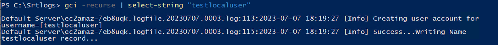
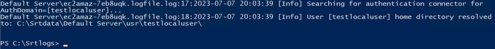
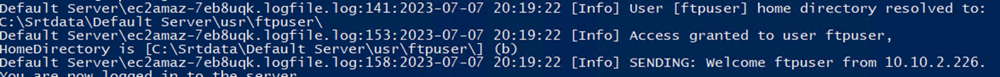
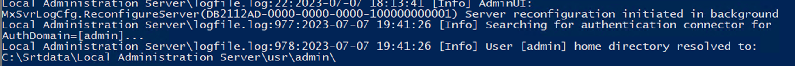
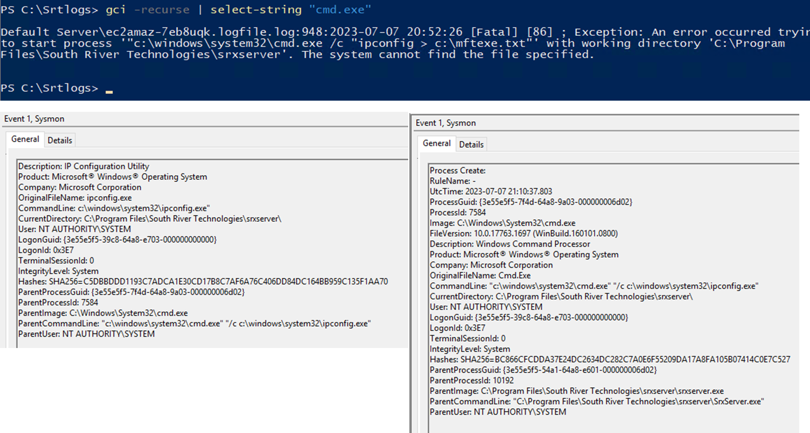

| Key                        | Value                                                                                   |
|----------------------------|-----------------------------------------------------------------------------------------|
| WebAppProcess              | srxserver.exe                                                                           |
| SelfHostedWebApp           | Yes                                                                                     |
| ProductName                | Cornerstone MFT                                                                         |
| WebAppDirectory            | "C:\\Program Files\\South River Technologies\\srxserver\\"                              |
| WebAppCmdLine              | C:\\Program Files\\South River Technologies\\srxserver\\SrxServer.exe                   |
| WebAppParent               | services.exe                                                                            |
| WebAppGParent              | wininit.exe                                                                             |
| MFTServiceName             | Cornerstone MFT Server NextGen                                                          |
| AutomationProcess          | "C:\\Program Files\\MFT Server\\server.exe"                                             |
| AutomationProcessCmdLine   | C:\\Program Files\\MFT Server\\server.exe                                               |
| WebAdminPort               | 31443                                                                                   |
| DefaultWebUserPort         | 7003                                                                                    |
| DefaultFTPPortMFTListen    | 21                                                                                      |
| DefaultSFTPPortMFTListen   | 22                                                                                      |
| DefaultFTPSMFTListen       | 990                                                                                     |
| DefaultHTTPMFTListen       | 80                                                                                      |
| DefaultHTTPSMFTListen      | 443                                                                                     |
| DefaultOFTPMFTListen       | 3305                                                                                    |
| DefaultHTTPAPI             | 11880                                                                                   |
| DefaultHTTPSAPI            | 11443                                                                                   |
| MFTDataBaseDirectory       | C:\\ProgramData\\South River Technologies\\srxserver\\database                          |
| MFTUsers                   | C:\\Srtdata\\Default Server\\usr                                                        |
| MFTDefaultLogDirectory     | C:\\Srtlogs                                                                             |
| MFTLoggingConfig           | C:\\ProgramData\\South River Technologies\\srxserver\\database\\%MFTServerDatabasefile% |
| MFTAuthenticationLogs      | c:\\srtlogs\\%mftservername%\\%hostname%.logfile.%datae%                                |
| MFTFileTransferLogs        | c:\\srtlogs\\%mftservername%\\%hostname%.logfile.%datae%                                |
| SupportsAutomationCommands | Yes                                                                                     |
| AutomationProcess          | C:\\Program Files\\South River Technologies\\srxserver\\srxserver.exe                   |
| AutomationProcessCmdLine   | C:\\Program Files\\South River Technologies\\srxserver\\srxserver.exe                   |
| MFTAutomationArtifact      | c:\\srtlogs\\%mftservername%\\%hostname%.logfile.%datae%                                |

| **Key Software Components**                                                                                                                                                                                                                                   |
|---------------------------------------------------------------------------------------------------------------------------------------------------------------------------------------------------------------------------------------------------------------|
| Web Hosting Process: srxserver.exe                                                                                                                                                                                                                            |
| Web Hosting Process Working Directory: C:\\Program Files\\South River Technologies\\srxserver\\                                                                                                                                                               |
| Web Hosting Process Command Line: "C:\\Program Files\\South River Technologies\\srxserver\\SrxServer.exe"                                                                                                                                                     |
| Web Hosting Process parent: services.exe                                                                                                                                                                                                                      |
| Web Hosting Process grandparent: wininit.exe                                                                                                                                                                                                                  |
| Admin Portal: https://localhost:31443/                                                                                                                                                                                                                        |
| MFT Portal: http://127.0.0.1:7003/mftconsole/faces/login (7003 by default but configurable)                                                                                                                                                                   |
|                                                                                                                                                                                                                                                               |
| **Log Sources for Common Attacker Actions**                                                                                                                                                                                                                   |
| New User Creation: c:\\srtlogs\\%hostname%.logfile.%datae% (example: C:\\srtlogs\\Default Server\\ec2amaz-7eb8uqk.logfile.20230707.0003.log)                                                                                                                  |
| User Authentication Event via HTTP: c:\\srtlogs\\%mftservername%\\%hostname%.logfile.%datae% (example: C:\\srtlogs\\Default Server\\ec2amaz-7eb8uqk.logfile.20230707.0003.log) [NO IP Registered]                                                             |
| User Authentication Event via SFTP/FTP: c:\\srtlogs\\%mftservername%\\%hostname%.logfile.%datae% (example: C:\\srtlogs\\Default Server\\ec2amaz-7eb8uqk.logfile.20230707.0003.log) [ IP Registered]                                                           |
| User Authentication to Admin Console: c:\\srtlogs\\%adminservername%\\%hostname%.logfile.%datae% (example: C:\\srtlogs\\Local Administration Server\\ec2amaz-7eb8uqk.logfile.20230707.0003.log)                                                               |
| File Activity Events: c:\\srtlogs\\%mftservername%\\%hostname%.logfile.%datae% (example: C:\\srtlogs\\Default Server\\ec2amaz-7eb8uqk.logfile.20230707.0003.log)                                                                                              |
| Command Execution via MFT Automation: **YES**                                                                                                                                                                                                                 |
| Command Execution via MFT Automation Activity: c:\\srtlogs\\%mftservername%\\%hostname%.logfile.%datae% (example: C:\\srtlogs\\Default Server\\ec2amaz-7eb8uqk.logfile.20230707.0003.log)                                                                     |
|                                                                                                                                                                                                                                                               |
| **Command Execution via MFT Automation**                                                                                                                                                                                                                      |
| ParentImage: C:\\Program Files\\South River Technologies\\srxserver\\srxserver.exe                                                                                                                                                                            |
| OriginalFileName: Cmd.Exe                                                                                                                                                                                                                                     |
| CommandLine: "c:\\windows\\system32\\cmd.exe" "/c c:\\windows\\system32\\ipconfig.exe"                                                                                                                                                                        |
| **Documentation**                                                                                                                                                                                                                                             |
| Showing Cornerstone API executable srxCFG.exe (https://helpdesk.southrivertech.com/portal/en/kb/articles/does-cornerstone-titan-provide-an-api-15-4-2020)                                                                                                     |
| Showing Cornerstone API Script Execution via Events (https://helpdesk.southrivertech.com/portal/en/kb/articles/how-to-run-a-script-with-a-scheduled-event-handler-22-7-2021)                                                                                  |
| Showing Where to Locate Logging Directory via the Console (https://southrivertech.com/support-docs/cornerstone/v16/webhelp/index.html\#Cornerstone/Configuration/Servers/Logging/Log_Settings_Tab.htm%3FTocPath%3DConfiguration%7CServers%7CLogging%7C_____2) |
| Showing Where to locate the Cornerstone Service Name (https://southrivertech.com/support-docs/cornerstone/v16/webhelp/index.html\#Cornerstone/Getting_Started/[ProductB]_Service.htm%3FTocPath%3DGetting%2520Started%7C_____3)                                |

