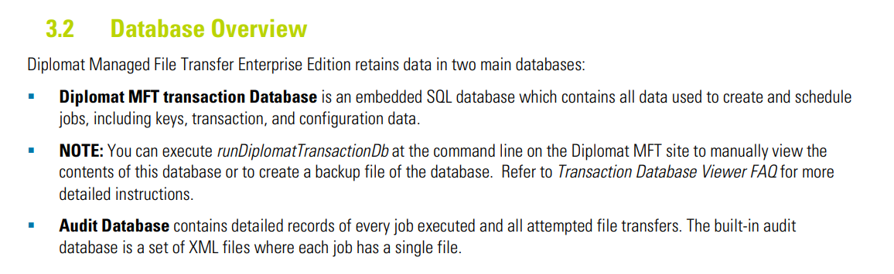
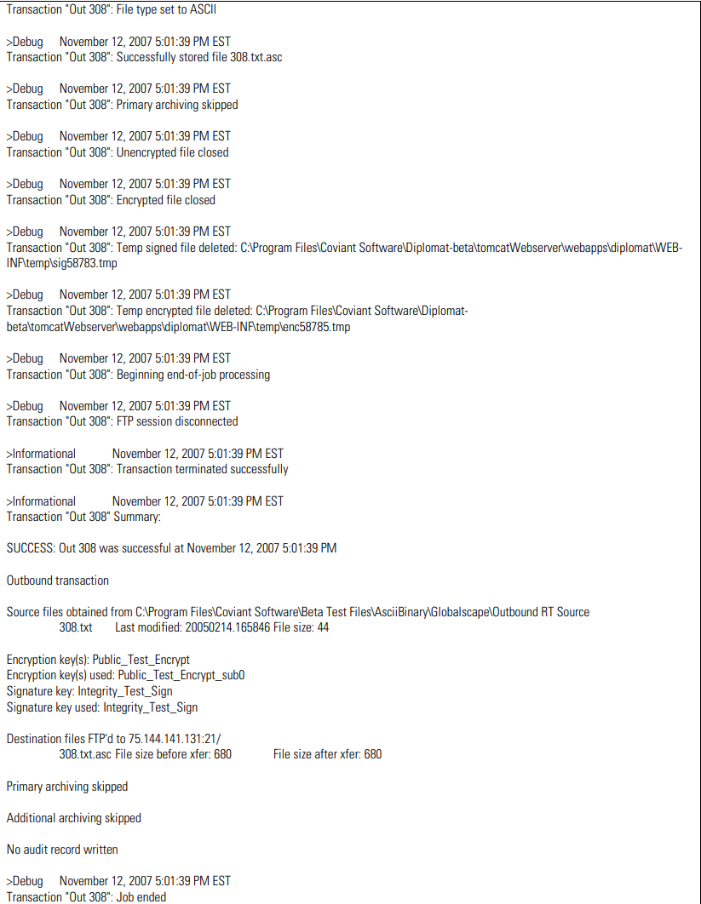
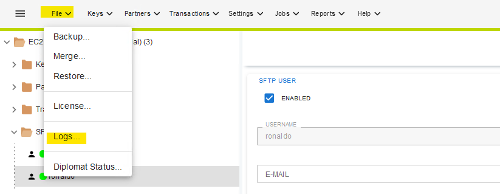

| **Key Software Components**                                                                             | **NOTES**                                                                                                        |                                                                                                                                                                                                                                              |
|---------------------------------------------------------------------------------------------------------|------------------------------------------------------------------------------------------------------------------|----------------------------------------------------------------------------------------------------------------------------------------------------------------------------------------------------------------------------------------------|
| **Web Hosting Process:**                                                                                | tomcat\*.exe                                                                                                     | ex: tomcat8.exe                                                                                                                                                                                                                              |
| **Service Name:**                                                                                       | Diplomat MFT 64                                                                                                  |                                                                                                                                                                                                                                              |
| **Web Hosting Process Working Directory:**                                                              | C:\\Program Files\\Coviant Software\\Diplomat-trial\\tomcatWebserver\\bin\\tomcat8.exe                           |                                                                                                                                                                                                                                              |
| **Web Hosting Process Command Line:**                                                                   | C:\\Program Files\\Coviant Software\\Diplomat-trial\\tomcatWebserver\\bin\\tomcat8.exe //RS//DiplomatTrialServer |                                                                                                                                                                                                                                              |
| **Web Hosting Process parent:**                                                                         | services.exe                                                                                                     |                                                                                                                                                                                                                                              |
| **Web Hosting Process grandparent:**                                                                    | winnit.exe                                                                                                       |                                                                                                                                                                                                                                              |
| **MFT Portal:**                                                                                         | <https://localhost:8081/>                                                                                        |                                                                                                                                                                                                                                              |
| **Commdand Working Directory:**                                                                         | C:\\Program Files\\Coviant Software\\Diplomat-trial\\tomcatWebserver\\bin                                        |                                                                                                                                                                                                                                              |
|                                                                                                         |                                                                                                                  |                                                                                                                                                                                                                                              |
| **Log Sources for Common Attacker Actions**                                                             | **NOTES**                                                                                                        |                                                                                                                                                                                                                                              |
| **New User Creation:**                                                                                  | Can be found in admin logs through portal                                                                        | click file\>logs\>logName                                                                                                                                                                                                                    |
| **User Authentication Event to Admin Console:**                                                         | Can be found in admin logs through portal                                                                        |                                                                                                                                                                                                                                              |
| **Default Reports Location:**                                                                           |  C:\\ProgramData\\Coviant Software\\Diplomat-trial\\reports                                                      |                                                                                                                                                                                                                                              |
| **Search Results Location:**                                                                            |  C:\\ProgramData\\Coviant Software\\Diplomat-trial\\search                                                       |                                                                                                                                                                                                                                              |
| **Audit DB Location (if not SQL):**                                                                     | C:\\ProgramData\\Coviant Software\\Diplomat-trial\\auditDb                                                       |                                                                                                                                                                                                                                              |
| **Tomcat Web Server Logs:**                                                                             | ...\\tomcatWebserver\\logs                                                                                       | windows - C:\\Program Files\\Coviant Software\\diplomat-j\\tomcatWebserver\\logs linux - opt/coviant/diplomatj/tomcatWebserver/logs                                                                                                          |
| **Default key directory:**                                                                              | windows - C:\\ProgramData\\Coviant Software\\Diplomat-j\\keys linux - /opt/coviant/diplomat-j/keys               | refer to page 64 of documentation                                                                                                                                                                                                            |
| **Default Log File Location:**                                                                          | windows - C:\\ProgramData\\Coviant Software\\Diplomat-j\\logs linux - /opt/coviant/diplomat-j/logs               | logs must be downloaded from admin portal                                                                                                                                                                                                    |
| **Default Primary Archive Location:**                                                                   | windows - C:\\ProgramData\\Coviant Software\\Diplomat-j\\archive linux - /opt/coviant/diplomat-j/archive         | Primary archive files are copies of the files that are transferred by Diplomat MFT file transfer jobs. The Primary Archive Settings allow you to archive files for every job in one centralized location  Refer to page 155 of documentation |
| **Admin Console Access Logs:**                                                                          | Can be found in admin logs through portal                                                                        |                                                                                                                                                                                                                                              |
|                                                                                                         |                                                                                                                  |                                                                                                                                                                                                                                              |
| **Command Execution via MFT Automation**                                                                |                                                                                                                  |                                                                                                                                                                                                                                              |
| **Command Execution via MFT Automation Activity within MFT Datastore:**                                 |                                                                                                                  |                                                                                                                                                                                                                                              |
| **Command Execution via MFT Auomation Activity within Logs:**                                           |                                                                                                                  |                                                                                                                                                                                                                                              |
| **ParentImage:**                                                                                        |                                                                                                                  |                                                                                                                                                                                                                                              |
| **ParentImage Commandline:**                                                                            |                                                                                                                  |                                                                                                                                                                                                                                              |
| **OriginalFileName:**                                                                                   |                                                                                                                  |                                                                                                                                                                                                                                              |
| **Commandline:**                                                                                        |                                                                                                                  |                                                                                                                                                                                                                                              |
|                                                                                                         |                                                                                                                  |                                                                                                                                                                                                                                              |
| **ADDITIONAL DATA**                                                                                     | **NOTES**                                                                                                        |                                                                                                                                                                                                                                              |
| **Version:**                                                                                            | 9.1.1                                                                                                            |                                                                                                                                                                                                                                              |
| **Tomcat Version**                                                                                      | 8.5.81                                                                                                           |                                                                                                                                                                                                                                              |
| **Default Install Dir:**                                                                                | C:\\Program Files\\Coviant Software\\Diplomat-j                                                                  |                                                                                                                                                                                                                                              |
| **Default Backup Dir:**                                                                                 | C:\\ProgramData\\Coviant Software\\Diplomat-j\\backup                                                            | all backup files have ".dbu" extension                                                                                                                                                                                                       |
| **Default Server Port:**                                                                                | 8080  8443 if "Use secure connection" is UNCHECKED                                                               |                                                                                                                                                                                                                                              |
| **Default Ports:**                                                                                      | 20, 21, 25, 80, 110, 443, 989, 990                                                                               |                                                                                                                                                                                                                                              |
| **Default Diplomat Cloud Connector Port:**                                                              | 8082                                                                                                             |                                                                                                                                                                                                                                              |
| **Default password for username "Administrator":**                                                      | "diplomat"                                                                                                       | Refer to page 56 of documentation                                                                                                                                                                                                            |
| **Default password for all new liceneses:**                                                             | "diplomat"                                                                                                       | Refer to page 15 of documentation                                                                                                                                                                                                            |
| **Diplomat MFT data files:**                                                                            | Under install directory or C:\\ProgramData\\Coviant Software\\Diplomat-j                                         |                                                                                                                                                                                                                                              |
| **Documentation:**                                                                                      | <https://knowledgebase.coviantsoftware.com/wp-content/uploads/2020/02/Diplomat_Standard_User_Guide_v6.1.2.pdf>   |                                                                                                                                                                                                                                              |
| **Accounts with Administrator privileges can select the Show Password button to display the password.** |                                                                                                                  | Refer to page 110 of document                                                                                                                                                                                                                |

