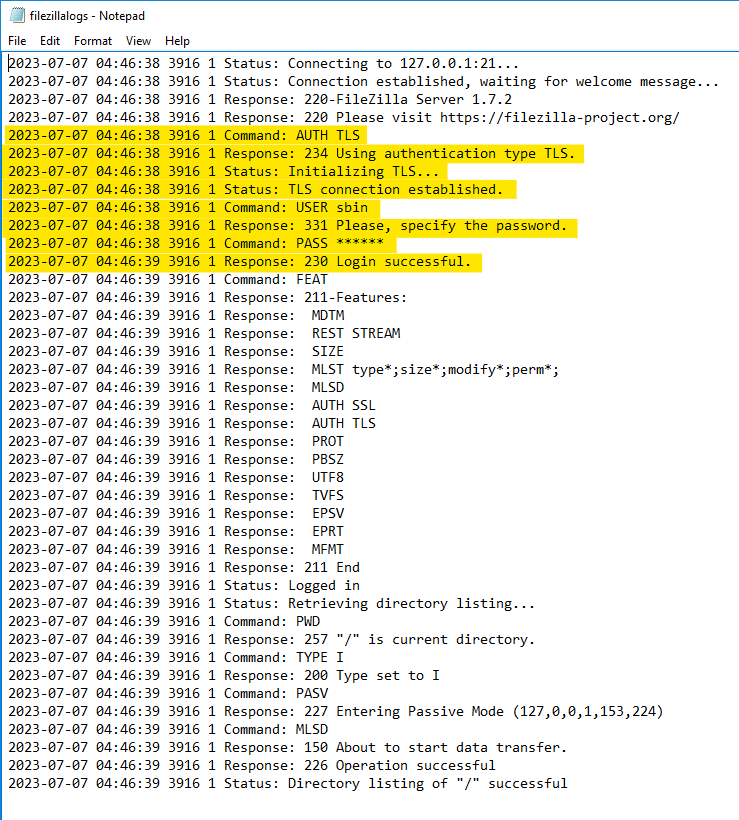
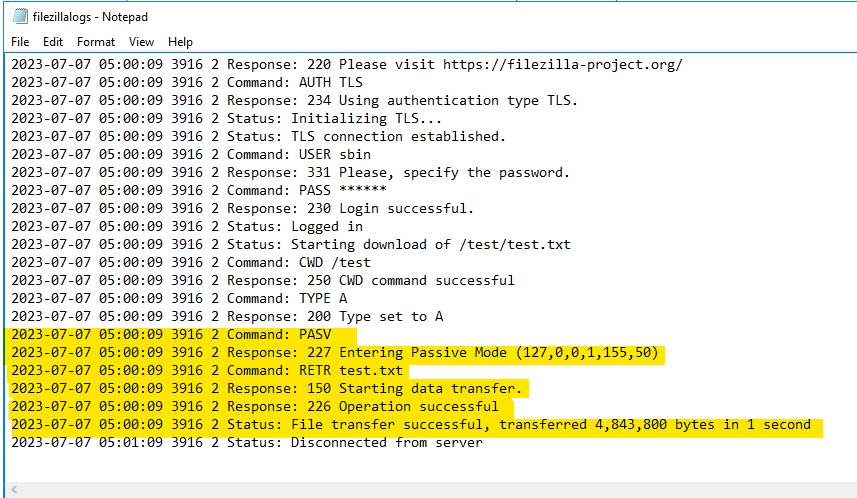
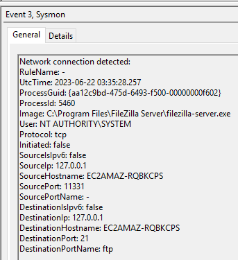

| **KEY SOFTWARE COMPONENTS**                                    | **NOTES**                                                                                                                                                                                                                                           |                                                                                                                                                                                                                                                                                                                                                                                                                                                |
|----------------------------------------------------------------|-----------------------------------------------------------------------------------------------------------------------------------------------------------------------------------------------------------------------------------------------------|------------------------------------------------------------------------------------------------------------------------------------------------------------------------------------------------------------------------------------------------------------------------------------------------------------------------------------------------------------------------------------------------------------------------------------------------|
| **Default Hosting Process:**                                   | filezilla-server.exe (server) filezilla.exe (client) filezilla-server-gui.exe                                                                                                                                                                       |                                                                                                                                                                                                                                                                                                                                                                                                                                                |
| **filezilla-server.exe Parent Process:**                       | services.exe                                                                                                                                                                                                                                        |                                                                                                                                                                                                                                                                                                                                                                                                                                                |
| **filezilla-server.exe Grandparent Process:**                  | winnit.exe                                                                                                                                                                                                                                          |                                                                                                                                                                                                                                                                                                                                                                                                                                                |
| **filezilla-server-gui.exe Parent Process:**                   | explorer.exe                                                                                                                                                                                                                                        |                                                                                                                                                                                                                                                                                                                                                                                                                                                |
| **filezilla.exe Parent Process:**                              | explorer.exe                                                                                                                                                                                                                                        |                                                                                                                                                                                                                                                                                                                                                                                                                                                |
| **Web Hosting Process Command Line:**                          | C:\\Program Files\\FileZilla Server\\filezilla-server.exe C:\\Program Files\\FileZilla Server\\filezilla-server-gui.exe C:\\Program Files\\FileZilla FTP Client\\filezilla.exe                                                                      |                                                                                                                                                                                                                                                                                                                                                                                                                                                |
| **Service name:**                                              | FileZilla Server FileZilla FTP Client FileZilla Server Administration Client                                                                                                                                                                        |                                                                                                                                                                                                                                                                                                                                                                                                                                                |
| **FileZilla Server Administration Client Autostart Location:** | HKLM\\SOFTWARE\\Microsoft\\Windows\\CurrentVersion\\Run\\FileZilla Server                                                                                                                                                                           |                                                                                                                                                                                                                                                                                                                                                                                                                                                |
| **Web Hosting Process Working Directory:**                     | filezilla.exe = C:\\Program Files\\FileZilla FTP Client\\filezilla.exe filezilla-server.exe = C:\\Program Files\\FileZilla Server\\filezilla-server.exe filezilla-server-gui.exe = C:\\Program Files\\FileZilla Server\\filezilla-server-gui.exe    |                                                                                                                                                                                                                                                                                                                                                                                                                                                |
| **Admin Portal:**                                              | Filezilla Server does not have any web administration                                                                                                                                                                                               | <https://forum.filezilla-project.org/viewtopic.php?t=53900>                                                                                                                                                                                                                                                                                                                                                                                    |
| **Index Portal:**                                              | <https://download.filezilla-project.org/>                                                                                                                                                                                                           |                                                                                                                                                                                                                                                                                                                                                                                                                                                |
|                                                                |                                                                                                                                                                                                                                                     |                                                                                                                                                                                                                                                                                                                                                                                                                                                |
| **LOG SOURCES FOR COMMON ATTACKER ACTIONS**                    |                                                                                                                                                                                                                                                     |                                                                                                                                                                                                                                                                                                                                                                                                                                                |
| **Administrator password reset for server:**                   |  C:\\ProgramData\\filezilla-server\\settings.xml                                                                                                                                                                                                    | If the FileZilla Server service program is running under the SYSTEM user (the default, unless chosen differently at installation time), the file is located here source: https://wiki.filezilla-project.org/Password_reset                                                                                                                                                                                                                     |
| **New User Creation:**                                         | No logs created for user creation                                                                                                                                                                                                                   |                                                                                                                                                                                                                                                                                                                                                                                                                                                |
| **MFT Server Logs:**                                           | Default path: C:\\Program Files\\FileZilla Server\\Logs\\filezilla-server.log                                                                                                                                                                       | Log access is restricted to the user which FileZilla Server is running under, and any other account with administration capabilities source: https://forum.filezilla-project.org/viewtopic.php?p=177759\#p177759  information about logs: detailed log information: https://wiki.filezilla-project.org/Logs  Events that are logged: Connection ID, Time stamp, Username of account using connections, IP of initiator of connection, Log text |
| **MFT Client Logs:**                                           | No default location, must specify where server logs get saved                                                                                                                                                                                       | Refer to figure 1.1                                                                                                                                                                                                                                                                                                                                                                                                                            |
| **User Authentication Event to MFT Console:**                  | Gets saved to where "**MFT Client Logs**" are located                                                                                                                                                                                               | Refer to figure 1.2                                                                                                                                                                                                                                                                                                                                                                                                                            |
| **File Activity Events:**                                      | Gets saved to where "**MFT Client Logs**" are located                                                                                                                                                                                               | Refer to figure 1.3                                                                                                                                                                                                                                                                                                                                                                                                                            |
| **Command Execution via MFT Automation:**                      | NO                                                                                                                                                                                                                                                  | https://forum.filezilla-project.org/viewtopic.php?t=48695 possible automation?? : https://www.youtube.com/watch?v=bHWa3Ed6UUg                                                                                                                                                                                                                                                                                                                  |
| **Location that contains password to Server:**                 | \<filezilla\>\<admin\>\<password\> section of server settings file                                                                                                                                                                                  | [https://wiki.filezilla-project.org/FAQ\#FileZilla_Client_FAQ](https://wiki.filezilla-project.org/FAQ#FileZilla_Client_FAQ)                                                                                                                                                                                                                                                                                                                    |
| **Settings file is stored in:**                                | "%appdata%\\filezilla-server" folder                                                                                                                                                                                                                |                                                                                                                                                                                                                                                                                                                                                                                                                                                |
| **Systems user's appdata:**                                    | %windir%\\system32\\config\\systemprofile\\AppData\\Local\\                                                                                                                                                                                         |                                                                                                                                                                                                                                                                                                                                                                                                                                                |
| **Settings file path in logs:**                                | open \<installation folder\>\\Logs\\filezilla-server.log and find a line with "Settings written to " string                                                                                                                                         |                                                                                                                                                                                                                                                                                                                                                                                                                                                |
| **Sites and settings**                                         | "\~/.config/filezilla" directory                                                                                                                                                                                                                    | The odd exception is Windows, where the settings are stored in the %APPDATA%/FileZilla directory.                                                                                                                                                                                                                                                                                                                                              |
| **Configuration changes saved to:**                            | C:\\ProgramData\\filezilla-server\\groups.xml C:\\ProgramData\\filezilla-server\\users.xml C:\\ProgramData\\filezilla-server\\disallowed_ips.xml C:\\ProgramData\\filezilla-server\\allowed_ips.xml C:\\ProgramData\\filezilla-server\\settings.xml |                                                                                                                                                                                                                                                                                                                                                                                                                                                |
|                                                                |                                                                                                                                                                                                                                                     |                                                                                                                                                                                                                                                                                                                                                                                                                                                |
| **ADDITIONAL DATA**                                            |                                                                                                                                                                                                                                                     |                                                                                                                                                                                                                                                                                                                                                                                                                                                |
| **Version:**                                                   | 1.7.2                                                                                                                                                                                                                                               |                                                                                                                                                                                                                                                                                                                                                                                                                                                |
| **Default Install Directory:**                                 | C:\\Program Files\\FileZilla FTP Client                                                                                                                                                                                                             |                                                                                                                                                                                                                                                                                                                                                                                                                                                |
| **Default Ports:**                                             | Listening Port: 14148                                                                                                                                                                                                                               |                                                                                                                                                                                                                                                                                                                                                                                                                                                |
| **Dependencies:**                                              | libfilezilla wxWidgets GnuTLS libidn (unix systems) gettext (compiletime only) libdbus (unix systems) Perl Libtool autoconf automake                                                                                                                |                                                                                                                                                                                                                                                                                                                                                                                                                                                |
| **Additional Documentation**                                   | <https://wiki.filezilla-project.org/Special:AllPages>                                                                                                                                                                                               |                                                                                                                                                                                                                                                                                                                                                                                                                                                |

