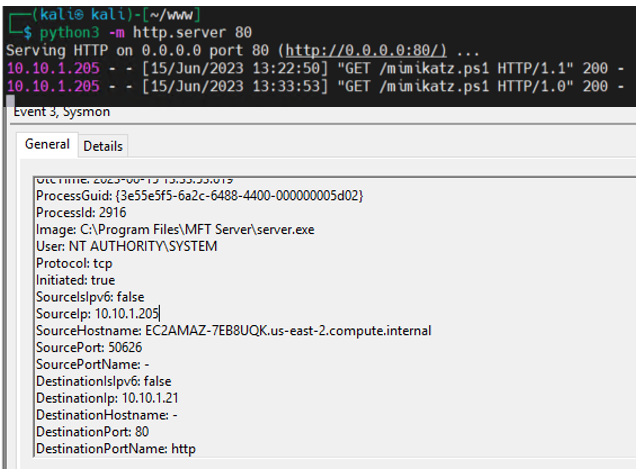
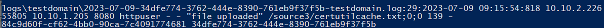
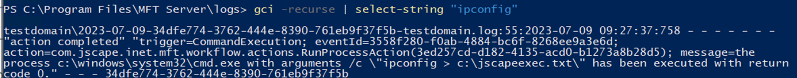
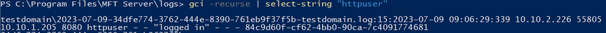
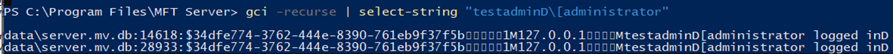
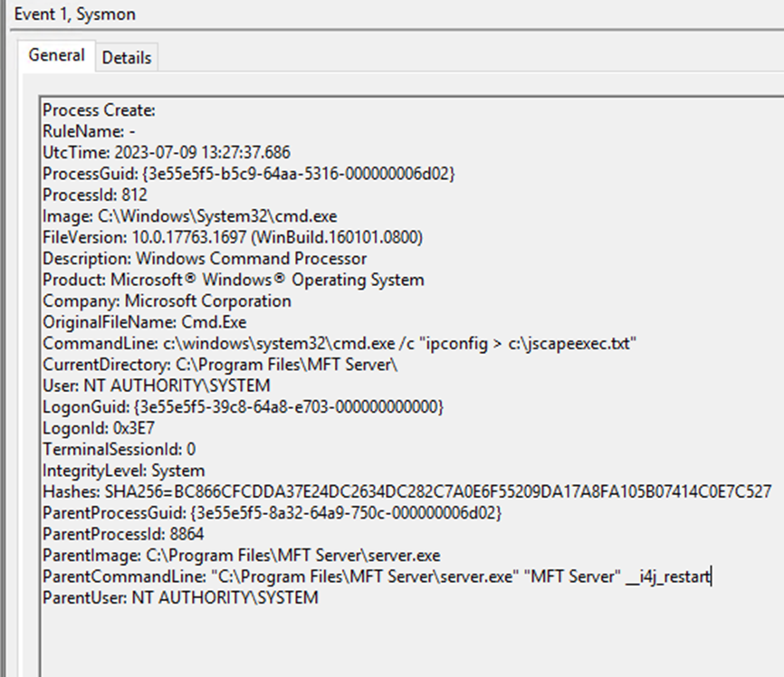

| Key                        | Value                                                                           |
|----------------------------|---------------------------------------------------------------------------------|
| WebAppProcess              | server.exe                                                                      |
| SelfHostedWebApp           | Yes                                                                             |
| ProductName                | JSCAPE MFT                                                                      |
| WebAppDirectory            | "C:\\Program Files\\MFT Server\\"                                               |
| WebAppProcessFullPath      | C:\\Program Files\\MFT Server\\server.exe                                       |
| WebAppCmdLine              | C:\\Program Files\\MFT Server\\server.exe                                       |
| WebAppParent               | services.exe                                                                    |
| WebAppGParent              | wininit.exe                                                                     |
| MFTServiceName             | MFT Server                                                                      |
| DefaultWebAdminPort        | 11880                                                                           |
| DefaultWebUserPort         | 80                                                                              |
| DefaultFTPPortMFTListen    | 21                                                                              |
| DefaultSFTPPortMFTListen   | 22                                                                              |
| DefaultFTPSMFTListen       | 990                                                                             |
| DefaultHTTPMFTListen       | 80                                                                              |
| DefaultHTTPSMFTListen      | 443                                                                             |
| DefaultOFTPMFTListen       | 3305                                                                            |
| DefaultHTTPAPI             | 11880                                                                           |
| DefaultHTTPSAPI            | 11443                                                                           |
| MFTDataBaseDirectory       | C:\\Program Files\\MFT Server\\data\\                                           |
| MFTUsers                   | C:\\Program Files\\MFT Server\\users                                            |
| MFTDefaultLogDirectory     | C:\\Program Files\\MFT Server\\logs                                             |
| MFTLogginConfig            | http://%MFTServer%:11880/2/rest/management/domains/test/logging?_=1690135179711 |
| MFTAuthenticationLogs      | %installdir%\\logs\\%domain%-%datetime%-%domainname%.log                        |
| MFTFileTransferLogs        | %installdir%\\logs\\%domain%-%datetime%-%domainname%.log                        |
| SupportsAutomationCommands | Yes                                                                             |
| AutomationProcess          | "C:\\Program Files\\MFT Server\\server.exe"                                     |
| AutomationProcessCmdLine   | C:\\Program Files\\MFT Server\\server.exe "MFT Server" \__i4j_restart           |
| MFTAutomationLogs          | %installdir%\\logs\\%domain%-%datetime%-%domainname%.log                        |

| **Key Software Components**                                                                                                                                                                                                                      |
|--------------------------------------------------------------------------------------------------------------------------------------------------------------------------------------------------------------------------------------------------|
| Web Hosting Process: server.exe                                                                                                                                                                                                                  |
| Web Hosting Process Working Directory: C:\\Program Files\\MFT Server\\                                                                                                                                                                           |
| Web Hosting Process Command Line: "C:\\Program Files\\MFT Server\\server.exe"                                                                                                                                                                    |
| Web Hosting Process parent: services.exe                                                                                                                                                                                                         |
| Web Hosting Process grandparent: wininit.exe                                                                                                                                                                                                     |
| Web Hosting Process Child: "C:\\Program Files\\MFT Server\\server.exe" "MFT Server" \__i4j_restart                                                                                                                                               |
| Admin Portal: https://localhost:11880 (configurable)                                                                                                                                                                                             |
| FTP/SFTP Access: localhost:21 localhost:22                                                                                                                                                                                                       |
| Internal Database Default Path: C:\\Program Files\\MFT Server\\data\\server.mv.db                                                                                                                                                                |
| External MYSQL Default Database: mysqlsserver:3306                                                                                                                                                                                               |
| HTTP REST API: localhost:11880                                                                                                                                                                                                                   |
| HTTPS REST API: localhost:11443                                                                                                                                                                                                                  |
|                                                                                                                                                                                                                                                  |
| **Log Sources for Common Attacker Actions**                                                                                                                                                                                                      |
| New User Creation: User creation events recovered from MFT database via creationDate value (Example: C:\\Program Files\\MFT Server\\data\\server.mv.db) - Events can be syslogged                                                                |
| User Authentication Events: %installdir%\\logs\\%domain%-%datetime%-%domainname%.log (example: C:\\program files\\mft server\\logs\\testdomain\\2023-07-09-34dfe774-3762-444e-8390-761eb9f37f5b-testdomain.log                                   |
| User Authentication to Admin Console: Admin events written only to MFT database. Admin auth events can be tracked with "administrator logged in" key word (Example: C:\\Program Files\\MFT Server\\data\\server.mv.db) - Events can be syslogged |
| File Activity Events: %installdir%\\logs\\%domain%-%datetime%-%domainname%.log (example: C:\\program files\\mft server\\logs\\testdomain\\2023-07-09-34dfe774-3762-444e-8390-761eb9f37f5b-testdomain.log)                                        |
| Command Execution via MFT Automation: **YES**                                                                                                                                                                                                    |
| Command Execution via MFT Automation Activity: %installdir%\\logs\\%domain%-%datetime%-%domainname%.log (example: C:\\program files\\mft server\\logs\\testdomain\\2023-07-09-34dfe774-3762-444e-8390-761eb9f37f5b-testdomain.log)               |
|                                                                                                                                                                                                                                                  |
| **Command Execution via MFT Automation**                                                                                                                                                                                                         |
| ParentImage: C:\\Program Files\\MFT Server\\server.exe                                                                                                                                                                                           |
| ParentImage CommandLine: "C:\\Program Files\\MFT Server\\server.exe" "MFT Server" \__i4j_restart                                                                                                                                                 |
| OriginalFileName: Cmd.Exe                                                                                                                                                                                                                        |
| CommandLine: c:\\windows\\system32\\cmd.exe /c "ipconfig \> c:\\jscapeexec.txt"                                                                                                                                                                  |
| **Documentation**                                                                                                                                                                                                                                |
| Showing server.exe in the MFT install directory as the service process (https://files.jscape.com/secureftpserver/docs/2023.1/) https://files.jscape.com/secureftpserver/docs/pdf/userguide.pdf page 36-45                                        |
| Showing default Admin and RESET interface values (https://files.jscape.com/secureftpserver/docs/2023.1/) https://files.jscape.com/secureftpserver/docs/pdf/userguide.pdf page 36-45                                                              |
| Showing Automation Actions including run process (https://files.jscape.com/secureftpserver/docs/2023.1/) https://files.jscape.com/secureftpserver/docs/pdf/userguide.pdf page 163                                                                |
| Showing Log Configurations: https://files.jscape.com/secureftpserver/docs/2023.1/ https://files.jscape.com/secureftpserver/docs/pdf/userguide.pdf page 70                                                                                        |
| Showing System Requirements: https://files.jscape.com/secureftpserver/docs/2023.1/ https://files.jscape.com/secureftpserver/docs/pdf/userguide.pdf page 3                                                                                        |
| Showing MFT Windows Server details: https://files.jscape.com/secureftpserver/docs/index.html https://files.jscape.com/secureftpserver/docs/pdf/userguide.pdf page 57                                                                             |

