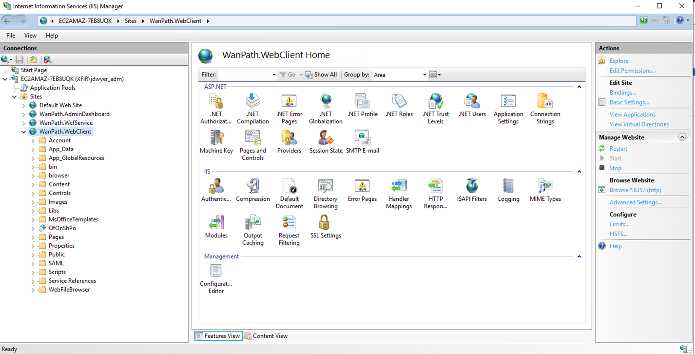
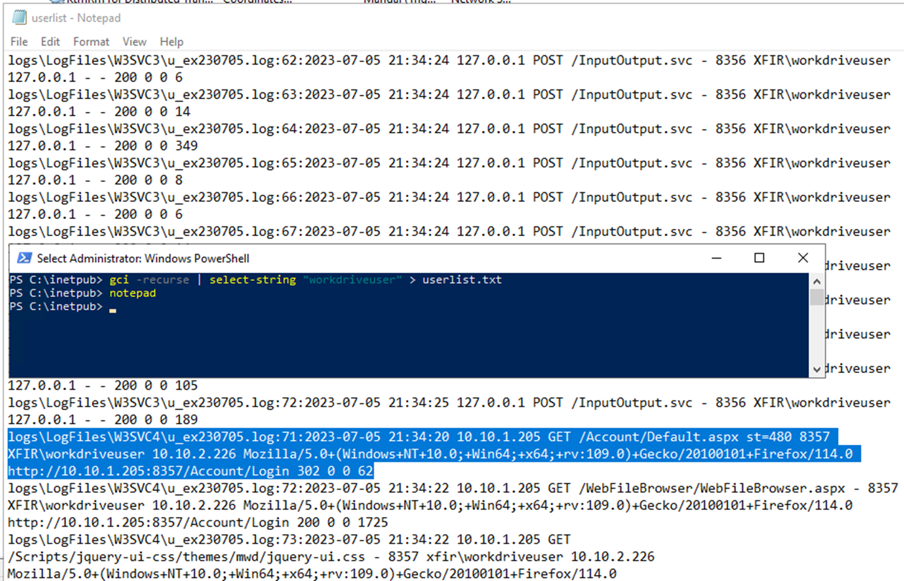
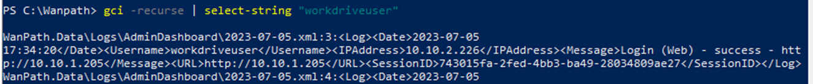
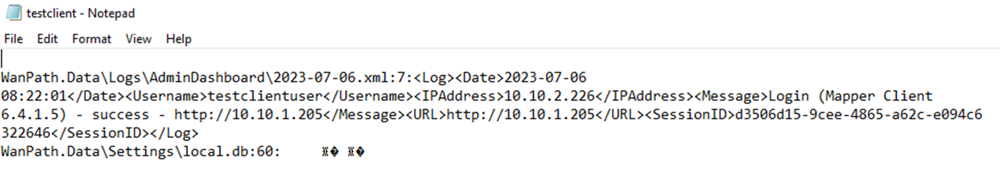
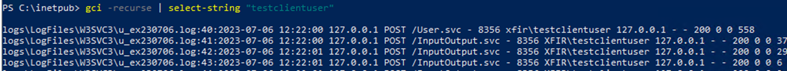
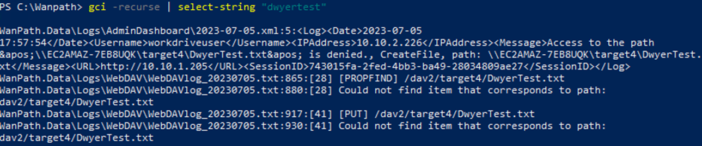
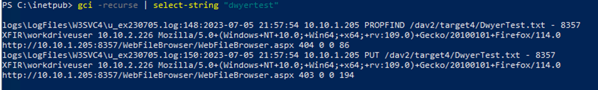
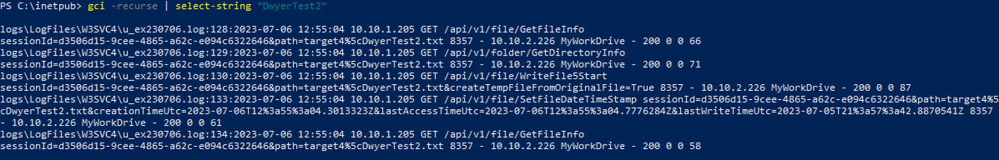
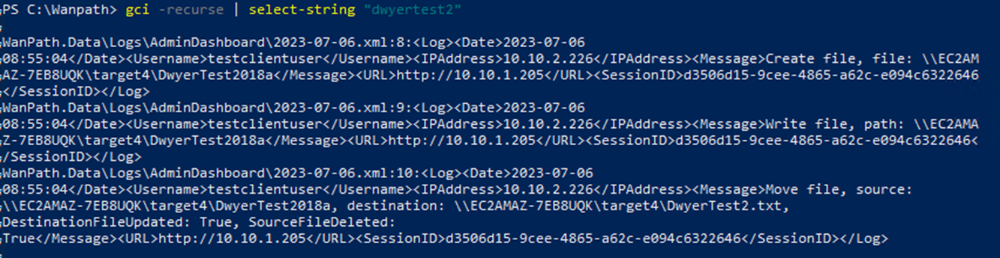

| Key                        | Value                                                                            |
|----------------------------|----------------------------------------------------------------------------------|
| WebAppProcess              | w3wp.exe                                                                         |
| SelfHostedWebApp           | No                                                                               |
| ProductName                | MyWorkDrive MFT                                                                  |
| WebAppDirectory            | c:\\Windows\\System32\\inetsrv\\                                                 |
| WebAppProcessFullPath      | c:\\Windows\\System32\\inetsrv\\w3wp.exe                                         |
| WebAppCmdLine              | w3wp.exe -ap "WanPath.WebClient"                                                 |
| WebAppParent               | svchost.exe                                                                      |
| WebAppGParent              | services.exe                                                                     |
| WebAppServiceName          | World Wide Web Publishing Service                                                |
| MFTAppProcess              | :C:\\Program Files (x86)\\Wanpath\\MyWorkDrive\\Service\\MyWorkDrive.Service.exe |
| MFTAppDirectory            | MFTProcess:C:\\Program Files (x86)\\Wanpath\\MyWorkDrive\\Service\\              |
| MFTAppCommandLine          | C:\\Program Files (x86)\\Wanpath\\MyWorkDrive\\Service\\MyWorkDrive.Service.exe  |
| MFTServiceName             | MyWorkDrive Service                                                              |
| DefaultWebAdminPort        | 8358                                                                             |
| DefaultWebUserPort         | 8357                                                                             |
| MFTDataBaseDirectory       | C:\\Wanpath\\WanPath.Data                                                        |
| MFTUsers                   | WanPath.Data\\Logs\\AdminDashboard\\Log-%date%                                   |
| MFTDefaultLogDirectory     | C:\\Wanpath\\WanPath.Data\\Logs\\                                                |
| MFTLogginConfig            | C:\\Wanpath\\WanPath.Data                                                        |
| MFTAuthenticationLogs      | C:\\Wanpath\\WanPath.Data\\Logs\\AdminDashboard\\Log-\*                          |
| WebAppAuthenticationEvents | C:\\inetpub\\logs\\LogFiles\\W3SVC\*\\\*.log                                     |
| MFTFileTransferLogs        | C:\\WanPath\\WantPath.Data\\Logs\\AdminDashboard\\\*.xml                         |
| WebAppFileTransferLogs     | C:\\inetpub\\logs\\LogFiles\\W3SVC\*\\\*.log                                     |
| SupportsAutomationCommands | No                                                                               |

Key Software Components

Web Hosting Process: IIS (w3wp.exe)

Web Hosting Process Working Directory: c:\\Windows\\System32\\inetsrv\\

Web Hosting Admin Console Process Command Line:
c:\\windows\\system32\\inetsrv\\w3wp.exe -ap "WanPath.AdminDashboard" -v "v4.0"
\-l "webengine4.dll" -a \\\\.\\pipe\\iisipm16d72fbe-29e3-49c4-9763-0dd97d092046
\-h
"C:\\inetpub\\temp\\apppools\\WanPath.AdminDashboard\\WanPath.AdminDashboard.config"
\-w "" -m 0

Web Hosting Web Client Process Command Line:
c:\\windows\\system32\\inetsrv\\w3wp.exe -ap "WanPath.WebClient" -v "v4.0" -l
"webengine4.dll" -a \\\\.\\pipe\\iisipm1e964473-0040-49c0-95fe-487d37086c74 -h
"C:\\inetpub\\temp\\apppools\\WanPath.WebClient\\WanPath.WebClient.config" -w ""
\-m 0

Web Hosting Process Parent: svchost.exe

Web Hosting Process Parent CommandLine: C:\\Windows\\system32\\svchost.exe -k
iissvcs

Web Hosting Process grandparent: services.exe

Admin Portal: http://127.0.0.1:8358/Account/Login

Web Client Access http://localhost:8357/Account/Login

Oracle 12c Database Listener Process: tnslsnr.exe (Path is configurable example:
C:\\app\\Administrator\\product\\12.2.0\\dbhome_2\\BIN\\TNSLSNR.exe)

Oracle 12 Database Process: oracle.exe (Path is configurable example:
C:\\app\\Administrator\\product\\12.2.0\\dbhome_2\\bin\\oracle.exe)

Work Drive Service:"C:\\Program Files
(x86)\\Wanpath\\MyWorkDrive\\Service\\MyWorkDrive.Service.exe"

Work Drive Active Directory Service: "C:\\Program Files
(x86)\\Wanpath\\MyWorkDrive\\ActiveDirectoryService\\MyWorkDrive.ActiveDirectoryService.exe"

Work Drive Data Folder: C:\\WanPath

Log Sources for Common Attacker Actions

New User Creation: Controlled by Active Directory EID 4720 on domain controller

User Authentication Events in WorkDrive Logs:
C:\\Wanpath\\WanPath.Data\\Logs\\AdminDashboard\\Log-\*

User Authentication Events via IIS: IIS Log Directory (Default:
C:\\inetpub\\logs\\LogFiles\\W3SVC\*\\\*.log)

File Activity Event in WorkDrive Logs:
C:\\WanPath\\WantPath.Data\\Logs\\AdminDashboard\\\*.xml

File Activity Events in IIS Logs: IIS Log Directory (Default:
C:\\inetpub\\logs\\LogFiles\\W3SVC\*\\\*.log)

Command Execution via MFT Automation: No

Command Execution via MFT Automation

N/A

Documentation

Documentation Showing MyWorkDrive is built on IIS:
https://www.myworkdrive.com/support/myworkdrive-technical-overview/

Documentation Showing Default and Relevant Paths for MyWorkDrive software (where
log files are, processes involved for running):
https://www.myworkdrive.com/support/antivirus-settings-for-myworkdrive/

Documentation Showing Where Log Data Can Be Found On Disk:
https://www.myworkdrive.com/support/recommended-security-settings/

Notes

Because MyWorkDrive relies on Active Directory for authentication and
authorization, the MyWorkDrive server must be granted delegated authentication
for services. Security account delegation enables connection to multiple
servers, and each server change retains the authentication credentials of the
original client. Delegation of authentication is a capability that client and
server applications use when they have multiple tiers. It allows a public-facing
service to use client credentials to authenticate to an application or database
service. For this configuration to be possible, the client and the server must
run under accounts that are trusted for delegation

