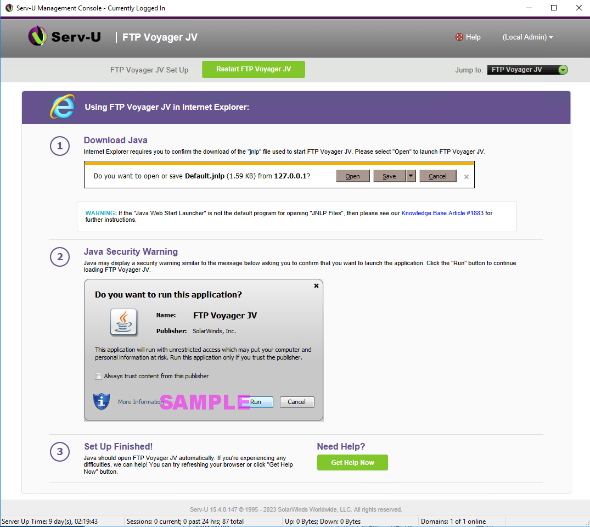
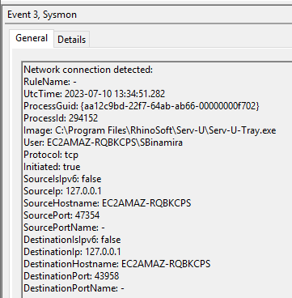

| Key                        | Value                                                      |
|----------------------------|------------------------------------------------------------|
| WebAppProcess              | Serv-U.exe                                                 |
| SelfHostedWebApp           | Yes                                                        |
| ProductName                | SolarWinds Serv-U                                          |
| WebAppProcessFullPath      | C:\\Program Files\\RhinoSoft\\Serv-U\\Serv-U.exe           |
| WebAppDirectory            | C:\\Program Files\\RhinoSoft\\Serv-U\\                     |
| WebAppCmdLine              | C:\\Program Files\\RhinoSoft\\Serv-U\\Serv-U.exe -service  |
| WebAppParent               | services.exe                                               |
| WebAppGParent              | wininit.exe                                                |
| MFTServiceName             | Serv-U File Server                                         |
| DefaultWebAdminPort        | 43958                                                      |
| DefaultWebUserPort         | 80                                                         |
| DefaultFTPPortMFTListen    | 21                                                         |
| DefaultSFTPPortMFTListen   | 22                                                         |
| DefaultFTPSMFTListen       | 990                                                        |
| DefaultHTTPMFTListen       | 80                                                         |
| DefaultHTTPSMFTListen      | 443                                                        |
| MFTDataBaseDirectory       | C:\\ProgramData\\RhinoSoft\\Serv-U                         |
| MFTUsers                   | C:\\Program Files\\MFT Server\\users                       |
| MFTDefaultLogDirectory     | C:\\ProgramData\\RhinoSoft\\Serv-U\\Users                  |
| MFTLogginConfig            | C:\\ProgramData\\RhinoSoft\\Serv-U\\Serv-U.Archive         |
| MFTAuthenticationLogs      | c:\\srtlogs\\%mftservername%\\%hostname%.logfile.%datae%   |
| MFTFileTransferLogs        | c:\\srtlogs\\%mftservername%\\%hostname%.logfile.%datae%   |
| SupportsAutomationCommands | Yes                                                        |
| AutomationProcess          | C:\\Program Files\\RhinoSoft\\Serv-U\\Serv-U.exe" -service |
| AutomationProcessCmdLine   | C:\\Program Files\\RhinoSoft\\Serv-U\\Serv-U.exe" -service |
| MFTAutomationArtifact      |  C:\\Serv-U\\Users\\%domain%\\%user%.Archive.\*            |

