| **Key Software Components**                                                                               | **Information**                                                                                                                                                                                                                                                   | **Documentation**                                                                                                                                              |
|-----------------------------------------------------------------------------------------------------------|-------------------------------------------------------------------------------------------------------------------------------------------------------------------------------------------------------------------------------------------------------------------|----------------------------------------------------------------------------------------------------------------------------------------------------------------|
| Default Hosting Process:                                                                                  | WFTPServer.exe(server) and WFTPTray.exe(client)                                                                                                                                                                                                                   |                                                                                                                                                                |
| WFTPServer.exe Default Hosting Parent Process:                                                            | service.exe                                                                                                                                                                                                                                                       |                                                                                                                                                                |
| WFTPTray.exe and WFTPServe.exe Default Hosting Parent Process:                                            | explorer.exe                                                                                                                                                                                                                                                      |                                                                                                                                                                |
| Web Hosting Process:                                                                                      | WFTPServer.exe                                                                                                                                                                                                                                                    |                                                                                                                                                                |
| Web Hosting Process Working Directory:                                                                    | C:\\Program Files (x86)\\Wing FTP Server\\WFTPServer.exe                                                                                                                                                                                                          |                                                                                                                                                                |
| Web Hosting Command Line:                                                                                 | C:\\Program Files (x86)\\Wing FTP Server\\WFTPServer.exe service                                                                                                                                                                                                  |                                                                                                                                                                |
| Web Hosting Parent:                                                                                       | service.exe(WFTPServer.exe)                                                                                                                                                                                                                                       |                                                                                                                                                                |
| Web Hosting Grandparent:                                                                                  | wininit.exe                                                                                                                                                                                                                                                       |                                                                                                                                                                |
| Admin Portal:                                                                                             | [https://127.0.0.1:5466](https://127.0.0.1:5466/)                                                                                                                                                                                                                 | <https://www.wftpserver.com/help/ftpserver/index.html?aoe.htm>                                                                                                 |
| MFT Portal:                                                                                               | does not have                                                                                                                                                                                                                                                     |                                                                                                                                                                |
| WingFTP Database Listner Process:                                                                         | No does not have mysqlserver.exe running or port 1433 open. Must specify odbc.                                                                                                                                                                                    | <https://www.wftpserver.com/help/ftpserver/index.html?database.htm>                                                                                            |
| WingFTP Database Process:                                                                                 | No does not have mysqlserver.exe running or port 1433 open. Must specify odbc.                                                                                                                                                                                    | <https://www.wftpserver.com/help/ftpserver/index.html?database.htm>                                                                                            |
| WingFTP Domain Ports:                                                                                     | FTP 21, SFTP 22, FTPS 990, HTTPS 443, HTTP 80                                                                                                                                                                                                                     | <https://www.wftpserver.com/help/ftpserver/index.html?listners.htm>                                                                                            |
| WingFTP Domain IP:                                                                                        | WildCard (Configurable)                                                                                                                                                                                                                                           | <https://www.wftpserver.com/help/ftpserver/index.html?ip_access.htm>                                                                                           |
| WingFTP Default Port web based administration:                                                            | 5466(Configurable)                                                                                                                                                                                                                                                |                                                                                                                                                                |
| Service Name:                                                                                             | Wing FTP Server                                                                                                                                                                                                                                                   |                                                                                                                                                                |
| WFTP Server.exe Autostart Location:                                                                       | HKLM\\System\\CurrentControlSet\\Services\\Wing FTP Server                                                                                                                                                                                                        |                                                                                                                                                                |
| WFTP Tray.exe Autostart Location:                                                                         | HKCU\\SOFTWARE\\Microsoft\\Windows\\CurrentVersion\\Run\\WingFTPTray                                                                                                                                                                                              |                                                                                                                                                                |
| Wing FTP Documentation                                                                                    | <https://www.wftpserver.com/help/ftpserver/>                                                                                                                                                                                                                      |                                                                                                                                                                |
| **Log Sources for Common Attacker Actions**                                                               |                                                                                                                                                                                                                                                                   |                                                                                                                                                                |
| New Admin User Creation:                                                                                  | Controlled by Wing FTP Server Administrator (C:\\Program Files(x86)\\Wing FTP Server\\WFTPTray.exe)                                                                                                                                                               |                                                                                                                                                                |
| New Admin User Creation Steps:                                                                            | 1. Double click Wing FTP Server Administrator, 2. Sign in Wing FTP Server Administrator, 3. Click Administrator, 4. Click Accounts, 5. Click Add Admin 6. Input Data.                                                                                             | <https://www.wftpserver.com/help/ftpserver/index.html?admin_user.htm>                                                                                          |
| New Admin User Creation Log:                                                                              | Stored in Wing FTP Server Administrator in admin log, and C:\\Program Files (x86)\\Wing FTP Server\\Log\\Admin\\Admin-%Y-%MM-%DD.log                                                                                                                              |                                                                                                                                                                |
| New User Creation:                                                                                        | Controlled by Wing FTP Server Administrator (C:\\Program Files(x86)\\Wing FTP Server\\WFTPTray.exe)                                                                                                                                                               |                                                                                                                                                                |
| New User Creation Steps:                                                                                  | 1. Double click Wing FTP Server Administrator 2. Sign in Wing FTP Server Administrator 3. Click Domain 4. Click Create Domain 5. Specify Name, IP, and Ports(Configurable) 6. Prompt Create User 7. Enter Username, Password and Home Directory.                  |                                                                                                                                                                |
| New User Creation Log:                                                                                    | Controlled by Wing FTP Server Administrator stored admin log and C:\\Program Files (x86)\\Wing FTP Server\\Log\\Admin\\Admin-%Y-%MM-%DD.log                                                                                                                       |                                                                                                                                                                |
| New Domain Creation log:                                                                                  | Controlled by Wing FTP Server Administrator stored server log and C:\\Program Files (x86)\\Wing FTP Server\\Log\\System\\System-%Y-%MM-%DD.log                                                                                                                    | <https://www.wftpserver.com/help/ftpserver/index.html?system_log.htm>                                                                                          |
| User Authentication Event to Admin Console:                                                               | Controlled by Wing FTP Server Administrator stored admin log and C:\\Program Files (x86)\\Wing FTP Server\\Log\\Admin\\Admin-%Y-%MM-%DD.log                                                                                                                       |                                                                                                                                                                |
| User Authentication to MFT Console:                                                                       | does not have only has web admin console.                                                                                                                                                                                                                         | <https://www.wftpserver.com/help/ftpserver/index.html?aoe.htm>                                                                                                 |
| File Activity Events:                                                                                     | Controlled by Wing FTP Server Administator stored domain log and C:\\Program Files (x86)\\Wing FTP Server\\Log\\Domains\\Domain Name\\%Y-%MM-%DD.log                                                                                                              | <https://www.wftpserver.com/help/ftpserver/index.html?domain_log.htm>                                                                                          |
| Wing FTP Upload / Download Permissions:                                                                   | Managed by Wing FTP Server Administrator when you add directory for user.                                                                                                                                                                                         |                                                                                                                                                                |
| FTP/SFTP/HTTP Authentication Events to MFT Server:                                                        | Controlled by Wing FTP Server Administrator Event Manager and stored in domain log and C:\\Program Files (x86)\\Wing FTP Server\\Log\\Domains\\Domain Name\\%Y-%MM-%DD.log                                                                                        |                                                                                                                                                                |
| Wing FTP Server Administrator FTP Events that are Logged in Domain Log Screenshot:                        | 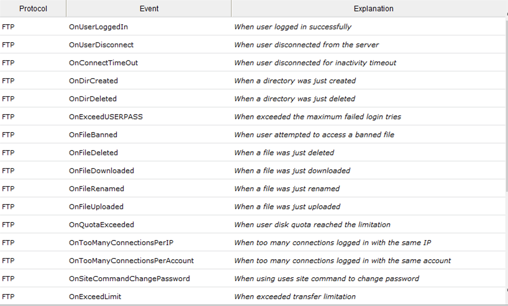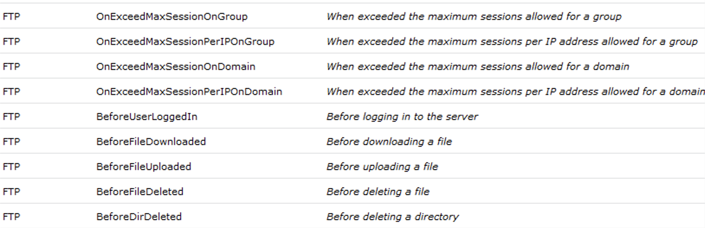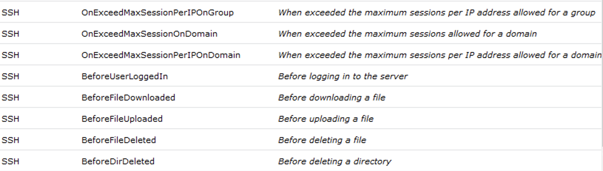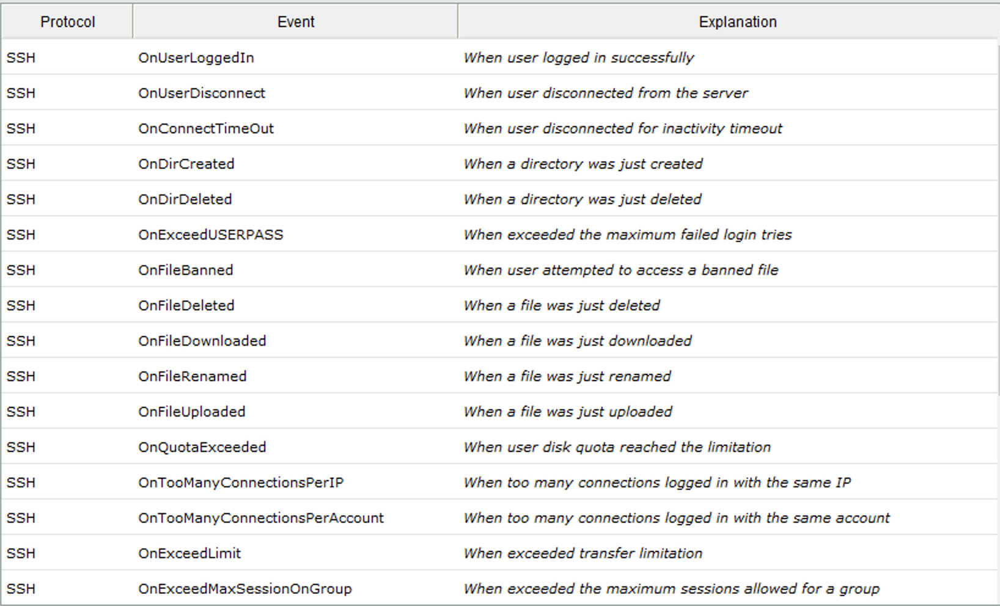                                                                      | <https://www.wftpserver.com/help/ftpserver/index.html?domain_log_setting.htm>                                                                                  |
| Wing FTP Server Administator SSH Events that are Logged in Domain Log Screenshot:                         |                                                                                                                                                                                                                                                                   | <https://www.wftpserver.com/help/ftpserver/index.html?domain_log_setting.htm>                                                                                  |
| Wing FTP Server Administator HTTP Events that are Logged in Domain Log Screenshot:                        | 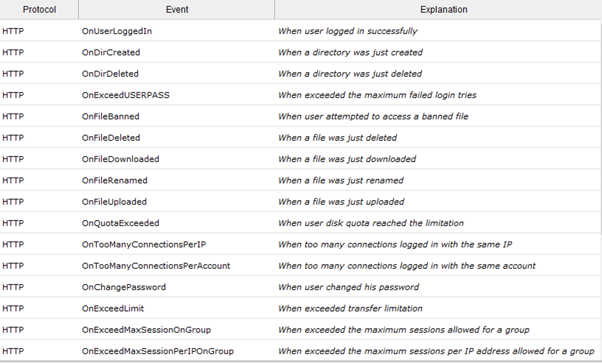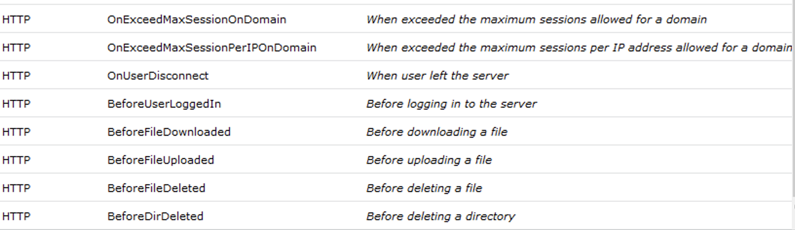                                                                                                                                                                    | <https://www.wftpserver.com/help/ftpserver/index.html?domain_log_setting.htm>                                                                                  |
| Wing FTP Server Administrator HTTP/HTTPS Authentication Event Based On User bill(Domain Log) Screenshot:  | 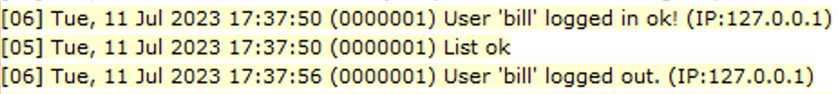                                                                                                                                                                                                                   |                                                                                                                                                                |
| Wing FTP Server Administrator SFTP Authentication Events(Domain Log) Screenshot:                          | 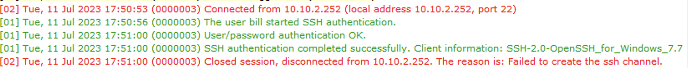                                                                                                                                                                                                                   |                                                                                                                                                                |
| Wing FTP Server Administrator FTP Authentication Events(Domain Log) Screenshot:                           | 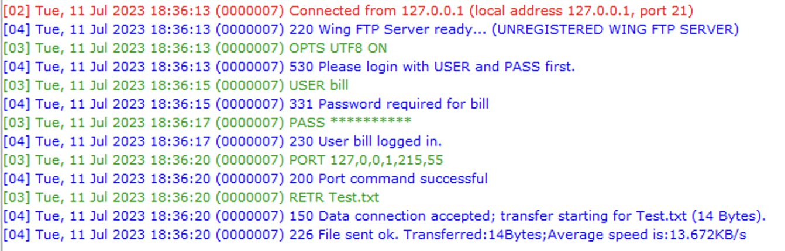                                                                                                                                                                                                                   |                                                                                                                                                                |
| FTP/SFTP File Activity Events:                                                                            | Controlled by Wing FTP Server Administrator stored in domain log and C:\\Program Files (x86)\\Wing FTP Server\\Log\\Domains\\Domain Name\\%Y-%MM-%DD.log                                                                                                          | [**https://www.wftpserver.com/help/ftpserver/index.html?domain_log_setting.htm**](https://www.wftpserver.com/help/ftpserver/index.html?domain_log_setting.htm) |
| Domain Startup:                                                                                           | Controlled by Wing FTP Server Administator stored in domain log and C:\\Program Files (x86)\\Wing FTP Server\\Log\\Domains\\Domain Name\\%Y-%MM-%DD.log                                                                                                           |                                                                                                                                                                |
| Domain Deletion:                                                                                          | Controlled by Wing FTP Server Administator stored in server log and C:\\Program Files (x86)\\Wing FTP Server\\Log\\System\\System-%Y-%MM-%DD.log                                                                                                                  |                                                                                                                                                                |
| All Logs Cleared(Server, Admin, Domain) Wing FTP Server Administator:                                     | Logs still exist in: C:\\Program Files (x86)\\Wing FTP Server\\Log\\Domains\\Domain Name\\%Y-%MM-%DD.log C:\\Program Files (x86)\\Wing FTP Server\\Log\\System\\System-%Y-%MM-%DD.log C:\\Program Files (x86)\\Wing FTP Server\\Log\\Admin\\Admin-%Y-%MM-%DD.log  |                                                                                                                                                                |
| Add user Wing FTP Server Administator:                                                                    | 1. Double click Wing FTP Server Administator 2. Sign in Wing FTP Server Administator(Admin Account) 3. Click Domain Drop Down Menu 4. Click Users 5. (+) Add Users 6. Input Data                                                                                  | <https://www.wftpserver.com/help/ftpserver/index.html?user_general.htm>                                                                                        |
| **Command Execution via Automation**                                                                      |                                                                                                                                                                                                                                                                   |                                                                                                                                                                |
| Command Execution via MFT Automation:                                                                     | **YES**                                                                                                                                                                                                                                                           | <https://www.wftpserver.com/help/ftpserver/index.html?server_lua_api.htm>                                                                                      |
| Command Execution via MFT Automation Activity within MFT Datastore:                                       | C:\\Program Files (x86)\\Wing FTP Server\\Log\\Admin\\Admin-%Y-%MM-%DD.log                                                                                                                                                                                        |                                                                                                                                                                |
| Wing FTP Server Administrator Command Execution via MFT Auomation Activity within Logs:                   | Controlled by Wing FTP Server Administrator (Admin Console and Server Task Scheduler) stored admin log and C:\\Program Files (x86)\\Wing FTP Server\\Log\\Admin\\Admin-%Y-%MM-%DD.log                                                                             | <https://www.wftpserver.com/help/ftpserver/index.html?lua_language.htm>                                                                                        |
| Administator Console Screenshot:                                                                          | 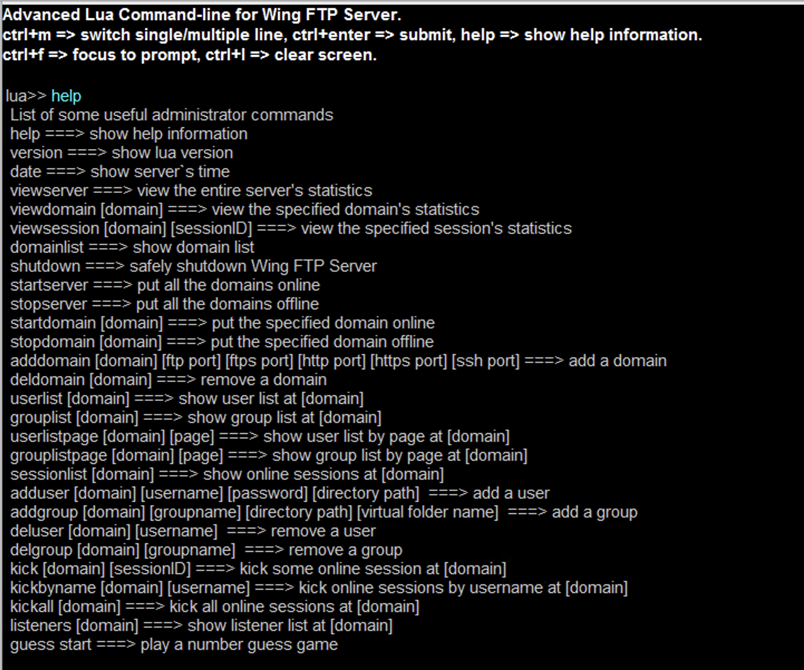                                                                                                                                                                                                                   | <https://www.wftpserver.com/help/ftpserver/index.html?administrator_console.htm>                                                                               |
| Task Scheduler Screenshot:                                                                                | 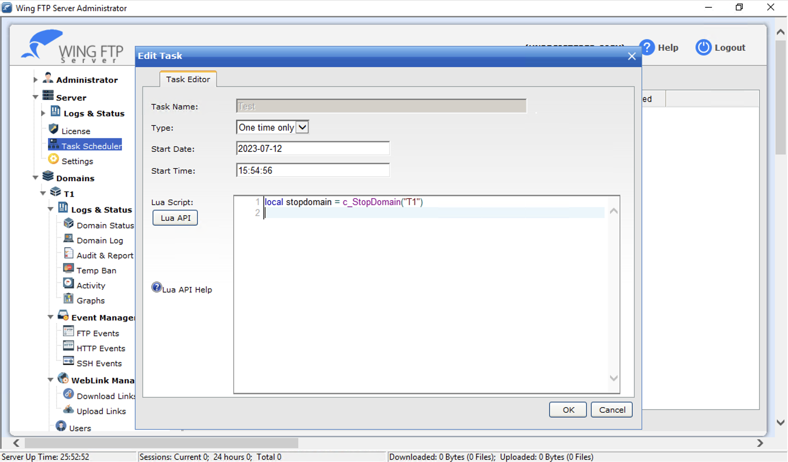                                                                                                                                                                                                                   | <https://www.wftpserver.com/help/ftpserver/index.html?system_task.htm>                                                                                         |
