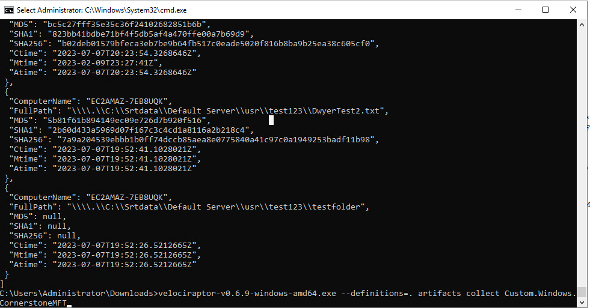

# MFT Respond

Collection of incident response templates for popular IR tools such as
Velociraptor to collect valuable data sources to aid in the response to an
incident involving an MFT server.

To run manually: velociraptor.exe --definitions=. artifacts collect MFT Artifact

